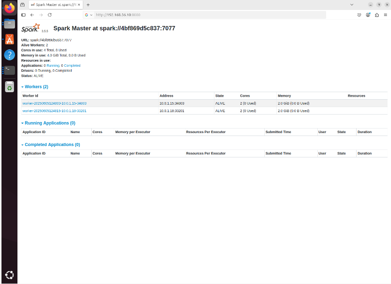

# HPC and Hybrid HPC–Big Data Clusters Project

## Authors

- Omar Hisham
- Soha Yehia
- Mohamed Ashour

## Supervisor

Dr. Mohamed Elsayeh

---

## Project Presentation

Presentation Video:
https://drive.google.com/file/d/1q4g5ICrAMWBueD9ApKcq4OujpX4KOtF2/view?usp=sharing

---

## Abstract

This project presents the implementation of both a traditional High-Performance Computing (HPC) cluster and a Hybrid HPC–Big Data cluster using virtual machines. The system integrates MPI-based distributed computing with Apache Spark running on Docker Swarm to support scalable machine learning and bioinformatics data analysis. The project demonstrates cluster deployment, distributed workload execution, and processing of gene expression datasets in a distributed environment.

---

## Project Objectives

- Build a three-node HPC cluster.
- Configure networking and passwordless SSH communication.
- Implement distributed computing using MPI and mpi4py.
- Deploy Apache Spark using Docker Swarm.
- Execute distributed machine learning workloads.
- Analyze bioinformatics gene expression datasets.

---

## System Architecture

| Node | Role | IP Address |
|--------|--------|--------|
| Master | Cluster Manager | 192.168.56.10 |
| Worker1 | Compute Node | 192.168.56.12 |
| Worker2 | Compute Node | 192.168.56.13 |

---
## Screenshots

### Passwordless SSH Configuration

[ssh_passwordless]_(ssh_passwordless.png)

Successful passwordless SSH communication between the master node and worker nodes, enabling seamless MPI execution across the cluster.

---

### Distributed MPI Execution


Execution of the distributed MPI-based machine learning application across multiple processes running on the HPC cluster.

---

### Apache Spark Web UI



Spark cluster status showing the registered worker nodes and available cluster resources after successful deployment using Docker Swarm.

---

## Technologies Used

- Ubuntu 24.04 LTS
- VirtualBox
- OpenMPI
- mpi4py
- Docker
- Docker Swarm
- Apache Spark
- Python
- NumPy
- Scikit-learn
- TensorFlow
- PySpark

---

## Project Structure

HPC-Hybrid-BigData-Cluster/
├── distributed_gene_analysis.py
├── spark-stack.yml
├── distributed_gene_expression_analysis.py
├── bioinfo_data/
│   └── leukemia_expression.csv
├── screenshots/
└── README.md

---

## Execution

### MPI-Based Analysis

```bash
mpirun -np 6 --hostfile hostfile python3 distributed_gene_analysis.py
